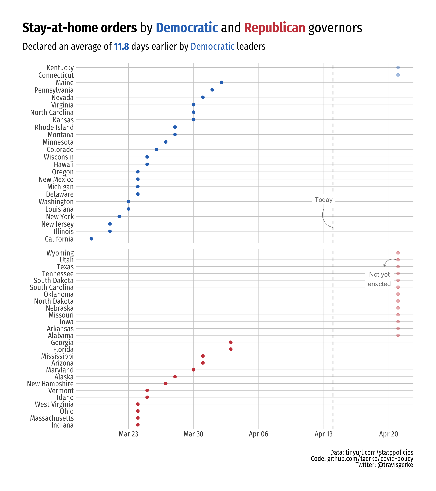
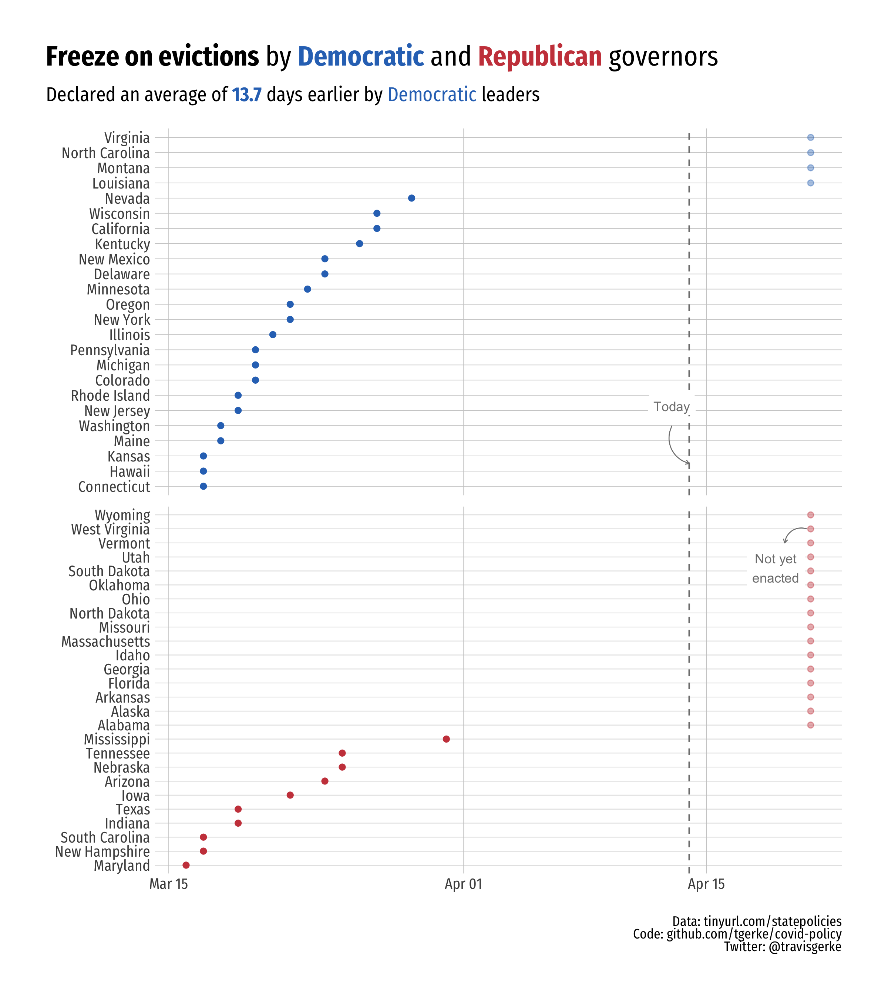
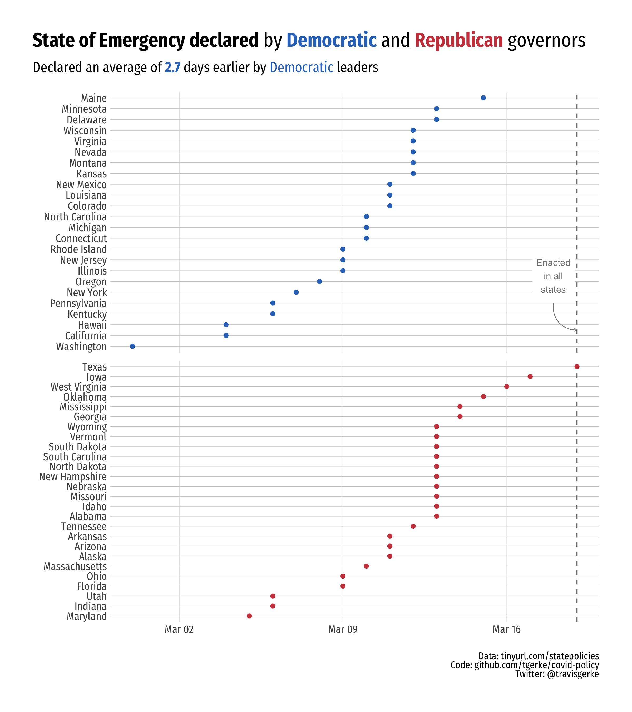

COVID-19 Policy Data
=====================
  
Data from [tinyurl.com/statepolicies](https://tinyurl.com/statepolicies) (h/t [@JuliaRaifman](https://twitter.com/JuliaRaifman/status/1245416835211812875)). Party affiliation data parsed from [Wikipedia](https://en.wikipedia.org/wiki/List_of_United_States_governors).

When policies have not yet been implemented, the optimistic assumption that such policies would be active in 7 days was made. This aligns with assumptions made in the [IHME models](https://covid19.healthdata.org/),. 

